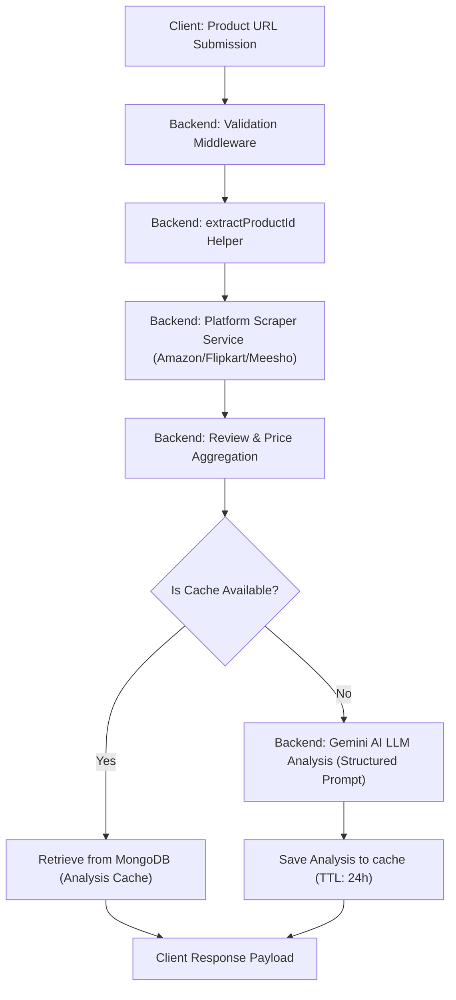
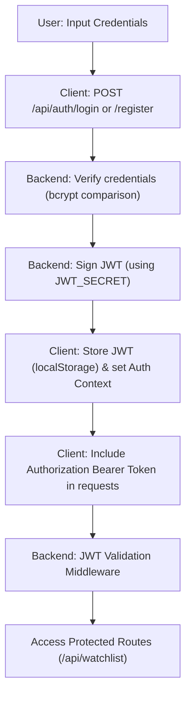
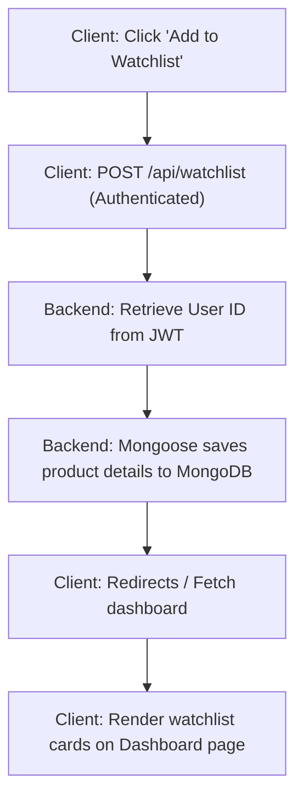
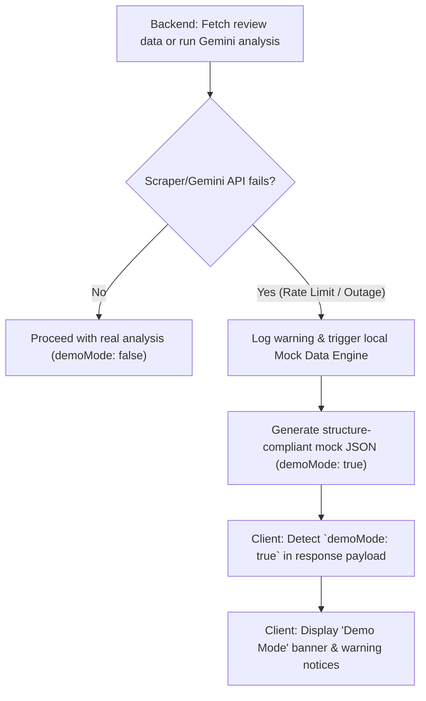

# NETflash — Architectural Documentation

This document outlines the software architecture, request pipelines, and database flow schemas of the NETflash AI Product Intelligence platform.

---

## 📌 High-Level Overview

NETflash utilizes a decoupled client-server architecture with persistent caching and generative AI components.

```
┌────────────────────────────────────────────────────────┐
│                   Client (React / Vite)                │
└───────────────────────────┬────────────────────────────┘
                            │ (HTTPS REST API Requests)
                            ▼
┌────────────────────────────────────────────────────────┐
│                   Server (Node.js / Express)           │
├───────────────────────────┼────────────────────────────┤
│  External Scraper APIs    │ Google Gemini AI SDK       │
│  (RapidAPI)               │ (Generative Review Parse)  │
└─────────────┬─────────────┴─────────────┬──────────────┘
              │                           │
              ▼                           ▼
┌────────────────────────────────────────────────────────┐
│               Database (MongoDB Atlas)                 │
│  Watchlist  │ User Auth │ AI Cache (TTL) │ Telemetry   │
└────────────────────────────────────────────────────────┘
```

- **Frontend (Client)**: A Single Page Application (SPA) built using React 18, Vite, React Router DOM, and Recharts. It handles user authentication state, aggregates chart visualization data, and dynamically renders alert metrics.
- **Backend (Server)**: A RESTful API built on Express.js. Handles client requests, performs validation, coordinates scraping tasks, interacts with Google Gemini Generative AI, generates security tokens, and implements caching bypass routes.
- **Database (MongoDB)**: Hosted on MongoDB Atlas, managed via Mongoose ODM. Persists user credential records, watchlist profiles, search telemetry logs, and caches generated analysis outputs to control API usage.
- **External Integrations**:
  - **Google Gemini Pro**: Analyzes scraped review datasets to identify red flags, pros/cons, and authentic sentiment metrics.
  - **RapidAPI Scrapers**: Gathers live product reviews and metadata from Amazon, Flipkart, and Meesho.
  - **YouTube Data API v3**: Supplies video review resources and metadata matching queried products.

---

## 🔄 System Flows

### 1. Analysis Request Flow
This flow details how a submitted product URL is validated, scraped, analyzed, and cached.



---

### 2. User Authentication Flow
Details session security, password verification, and JWT issuing.



---

### 3. Watchlist Flow
Shows how analyzed products are persisted and displayed in the user dashboard.



---

### 4. Demo Mode & Graceful Degradation Flow
Visualizes how the system handles scraper or Gemini AI API limits without failing.



---

## 📁 Repository Directory Structure

```
netflash/
├── .github/                  # GitHub actions and CI/CD pipelines
├── screenshots/              # Screenshots used for documentation
├── LICENSE                   # Project MIT License
├── README.md                 # Primary user documentation
├── ARCHITECTURE.md           # This architecture overview
├── CONTRIBUTING.md           # Development and workflow guidelines
├── backend/                  # REST API Server
│   ├── index.js              # Express entrypoint
│   ├── .env.example          # Template for backend config variables
│   ├── middleware/           # auth.js (JWT validation), rate limiting, error formatting
│   ├── models/               # Mongoose database schemas (User, Analysis, Cache, Search, etc.)
│   ├── routes/               # API endpoints (auth, analysis, watchlist)
│   ├── services/             # API connections (gemini, scraper, youtube, fallback engine)
│   ├── utils/                # logger (winston), parser helpers, and data validators
│   └── tests/                # Jest & Supertest integration files
└── frontend/                 # Client Single Page Application (SPA)
    ├── package.json          # Vite and frontend packages configuration
    ├── src/
    │   ├── components/       # Shared UI parts (Header, SellerTrustCard, Banner, etc.)
    │   ├── context/          # AuthContext for session propagation
    │   ├── pages/            # View states (Home, Results, Watchlist, Login, Register)
    │   └── utils/            # URL checkers and format helpers
    └── e2e/                  # Playwright browser automation tests
```
