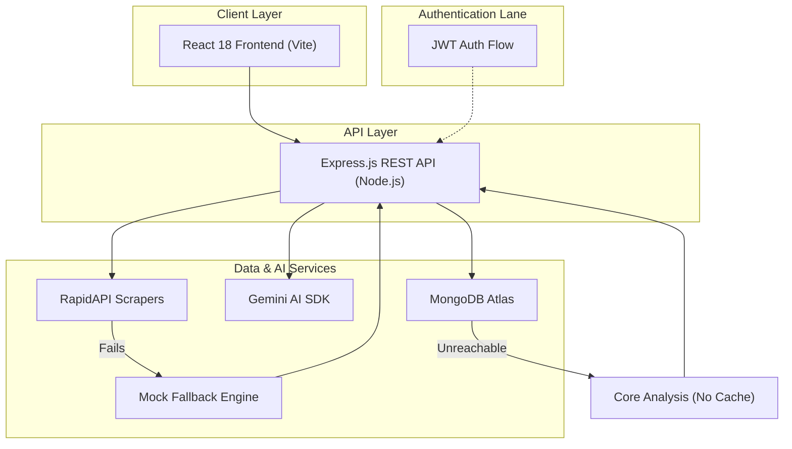
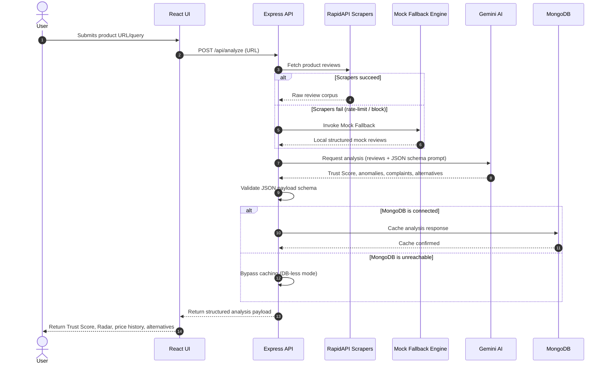
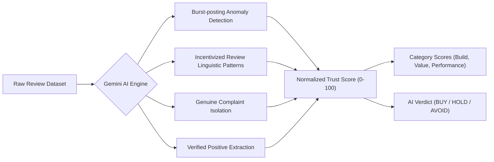

<div align="center">

# NETflash

**AI-Powered E-Commerce Product Intelligence & Resiliency Showcase**

[](https://nodejs.org/)
[](https://expressjs.com/)
[](https://react.dev/)
[](https://www.mongodb.com/atlas)
[](https://ai.google.dev/)
[](https://vite.dev/)
[](https://rapidapi.com/)
[](https://jwt.io/)

[](#)
[](#)
[](#)

</div>

---

## 📌 Overview

NETflash is an AI-driven product intelligence platform designed to extract
structured consumer insights from unstructured e-commerce reviews. The platform
aggregates review datasets from Amazon, Flipkart, and Meesho, processes them
using Large Language Models (LLMs), and displays metrics representing review
authenticity, price volatility, and key alternatives.

Designed with offline resiliency patterns, NETflash degrades gracefully when
external scrapers or databases fail.

> [!IMPORTANT]
> **Honest Positioning Notice**
>
> NETflash is not deployed to production and does not scrape real-time data in
> all cases. The Mock Fallback Engine is active when external scraper APIs are
> unavailable. Price history charts display mock data.
>
> This project demonstrates: LLM prompt engineering, API resilience patterns,
> graceful degradation, and full-stack JavaScript architecture.

---

## ⚙️ System Architecture & Data Flow

### System Architecture
The application runs on a three-tier architecture with separate authentication
and database failover paths:



### Product Analysis Sequence
This sequence outlines the end-to-end data processing workflow for review
aggregation and structural inference:



### Trust Score Computation
Raw sentiment inputs map into normalized scores and discrete categorical verdicts:



---

## 🛠️ Core Features & Technical Mechanisms

| Feature | Technical Mechanism |
| :--- | :--- |
| Review Authenticity Scoring | Gemini Pro analyzes review corpus via JSON-schema prompt; flags burst-posting anomalies and incentivized linguistic patterns |
| Trust Score | Normalized 0-100 composite from LLM-extracted signals: genuine complaints, verified positives, anomaly rate |
| Price Volatility Tracking | 30-day mock historical data rendered via Recharts area chart; roadmap item to replace with persisted DB logging |
| Cross-Platform Aggregation | Parallel RapidAPI calls to Amazon, Flipkart, Meesho scrapers; lowest-price identification server-side |
| Mock Fallback Engine | On RapidAPI failure (rate limit/region block), server catches error and serves realistic localized mock data |
| DB-less Graceful Degradation | Express detects MongoDB connection failure at startup; core analysis routes bypass cache and remain functional |
| Watchlist Persistence | JWT-authenticated routes; products saved to user's MongoDB Atlas document |
| AI Alternatives | Gemini returns dynamically generated substitute products as part of structured JSON response |

---

## 🛡️ Resilience Architecture

| Failure Scenario | Detection Method | Fallback Behavior | User Impact |
| :--- | :--- | :--- | :--- |
| RapidAPI rate limit / region block | HTTP error catch | Mock Fallback Engine serves localized data | Zero - analysis continues |
| MongoDB Atlas unreachable (IP block) | Connection error catch | DB-less mode, bypass cache | Auth/Watchlist unavailable; analysis works |
| Gemini AI returns malformed JSON | Server-side schema validation | Retry with stricter prompt or return error | Partial - user sees validation message |
| Gemini API quota exceeded | HTTP 429 catch | Cached result served if available | None if cached; error if cold request |

> [!WARNING]
> **Price Volatility Limitation**
>
> The 30-day price history shown in the analytics dashboard is currently mock
> data. Persistent historical logging is not yet implemented. This is listed in
> the roadmap.

> [!NOTE]
> **API Constraints & Fallbacks**
>
> RapidAPI free-tier keys have strict rate limits and may be region-blocked. The
> Mock Fallback Engine is active by default and will serve realistic data when
> external scraper APIs are unavailable.

---

## 🧠 Prompt Engineering

Raw Gemini outputs lack the deterministic formatting required for client-side API
consumption. To resolve this, NETflash uses a custom system prompt that wraps LLM
reasoning inside strict JSON-schema constraints. Server-side validation parses the
raw text, serving as a second line of defense against parsing crashes.

Expected Gemini JSON output payload structure:

```json
{
  "trust_score": 72,
  "verdict": "HOLD",
  "flagged_review_count": 14,
  "genuine_complaints": [
    "battery drain after 3 months",
    "plastic build quality"
  ],
  "verified_positives": [
    "fast delivery",
    "accurate color representation"
  ],
  "category_scores": {
    "build_quality": 65,
    "value_for_money": 80,
    "performance": 71
  },
  "ai_summary": "Overall balanced specifications but limited build quality durability."
}
```

---

## 📁 Project Structure

```text
netflash/
├── backend/
│   ├── index.js
│   ├── routes/
│   │   ├── analysis.js
│   │   ├── auth.js
│   │   └── watchlist.js
│   ├── services/
│   │   ├── geminiService.js
│   │   ├── scraperService.js
│   │   └── mockFallback.js
│   ├── models/
│   │   ├── User.js
│   │   └── WatchlistItem.js
│   ├── middleware/
│   │   └── authMiddleware.js
│   └── .env.example
├── frontend/
│   ├── src/
│   │   ├── components/
│   │   ├── pages/
│   │   ├── hooks/
│   │   └── utils/
│   └── vite.config.js
└── README.md
```

---

## ⚠️ Known Limitations

| Limitation | Current State | Planned Fix |
| :--- | :--- | :--- |
| Price history | Mock data only | Persistent DB logging (roadmap) |
| RapidAPI dependency | Free-tier rate limits apply | Paid tier or self-hosted scraper |
| LLM hallucination | Gemini may generate plausible but incorrect alternatives | Cross-reference with real product DB |
| Token cost scaling | Each analysis call consumes Gemini tokens | Redis caching layer (roadmap) |
| No real-time data | Snapshots only, no polling | BullMQ/node-cron price alerts (roadmap) |

---

## 🚀 Getting Started

### Prerequisites

| Requirement | Version | Purpose |
| :--- | :--- | :--- |
| Node.js | v18+ | JavaScript server-side execution environment |
| MongoDB Atlas account | Cloud account | Persists watchlist history and analysis caches |
| Gemini API key | Standard Tier | Translates raw text to structured sentiment intelligence |
| RapidAPI account | Scraper Tier | Integrates Amazon, Flipkart, and Meesho parser endpoints |

### ⚙️ Environment Variables

Copy the backend configuration variables to a local `.env` file:

| Variable | Required | Description |
| :--- | :--- | :--- |
| PORT | No | Network port the Express server binds to (default: 5000) |
| MONGODB_URI | Yes | Connection string to MongoDB database cluster |
| GEMINI_API_KEY | Yes | API credential token for Google Generative AI |
| RAPIDAPI_KEY | No | Access token for marketplace scrapers |
| JWT_SECRET | Yes | Private key signing authentication token signatures |
| JWT_EXPIRES_IN | No | Expiration lifespan definition for active tokens (e.g. 1d) |

### Installation

1. Clone the project repository:
   ```bash
   git clone https://github.com/sachin-saroj/netflash.git
   cd netflash
   ```

2. Configure and run the backend server:
   ```bash
   cd backend
   npm install
   # Create a .env file from template instructions
   node index.js
   ```

3. Configure and start the React client:
   ```bash
   cd ../frontend
   npm install
   npm run dev
   ```

4. Navigate to `http://localhost:5173` to run local analysis workflows.

---

## 🗺️ Project Roadmap

- [x] Gemini AI review authenticity scoring
- [x] Cross-platform price aggregation (Amazon, Flipkart, Meesho)
- [x] Mock Fallback Engine for API failures
- [x] DB-less graceful degradation mode
- [x] JWT auth + MongoDB Watchlist
- [ ] Persistent 30-day price history logging (replaces mock data)
- [ ] Redis caching for Gemini analysis results (reduce token cost)
- [ ] BullMQ/node-cron price drop alerts for Watchlist items
- [ ] Chrome extension: NETflash Trust Score overlay on product pages
- [ ] Token denylist on JWT logout

---

<div align="center">

Built with Node.js and Google Gemini AI · Not deployed to production  
Designed to demonstrate LLM integration and API resilience patterns

</div>


## Changelog
- **[#53]** Document Docker container layout setup (7)
- **[#51]** Optimize index search fields in schema (6)
- **[#49]** Add test assertions for categorizations logic (5)
- **[#47]** Improve timeout handling for api queries (4)
- **[#45]** Add performance telemetry logs (3)
- **[#43]** Refactor error alerts to use inline visual banners (2)
- **[#41]** Fix console warning in chart rendering (1)
- **[#39]** Update default documentation port reference in README
- **[#37]** Allow sorting competitor lists by price in dashboards
- **[#35]** Add product indexing optimizations on MongoDB schema
- **[#33]** Add try-catch error boundary wrapping Gemini pricing analysis
- **[#31]** Add fallback placeholder for missing product thumbnail images