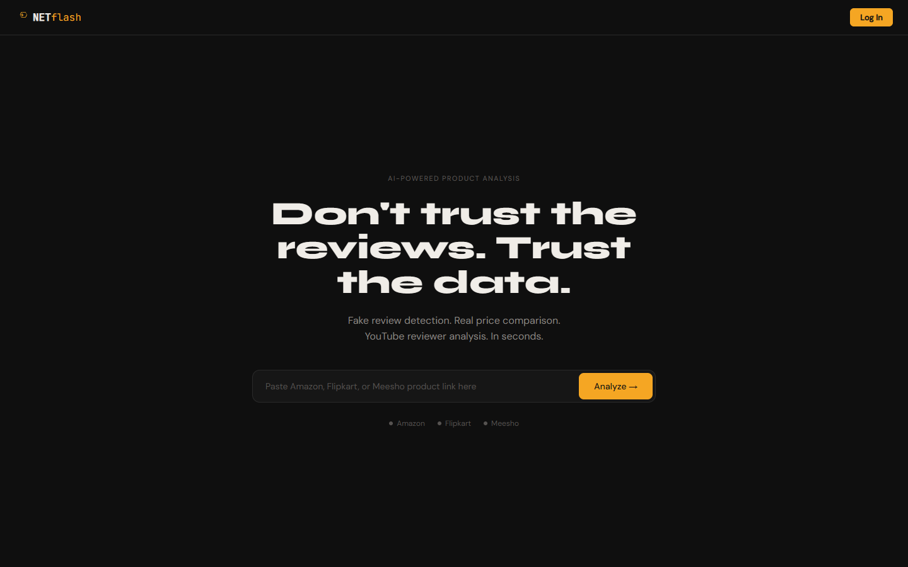
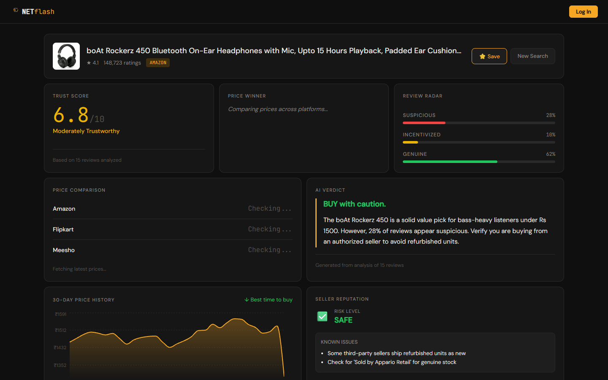
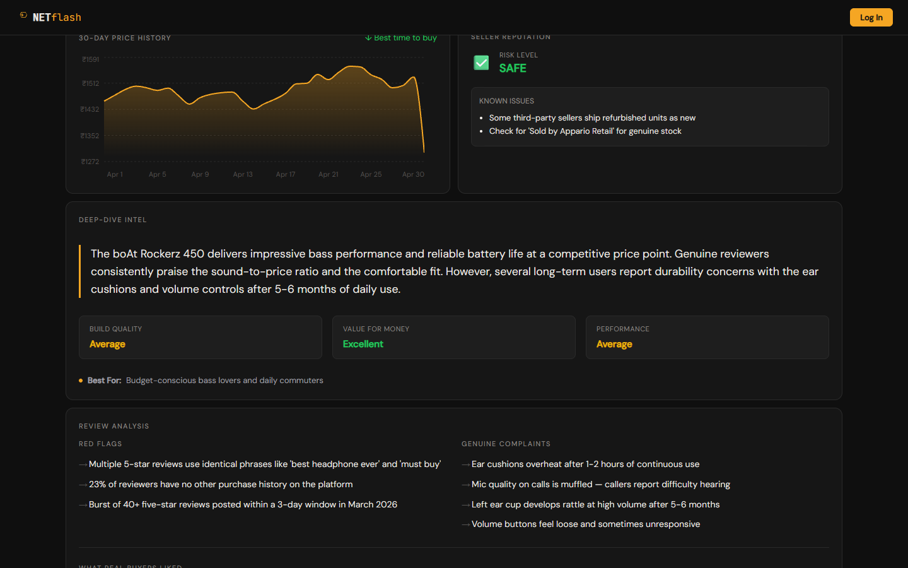
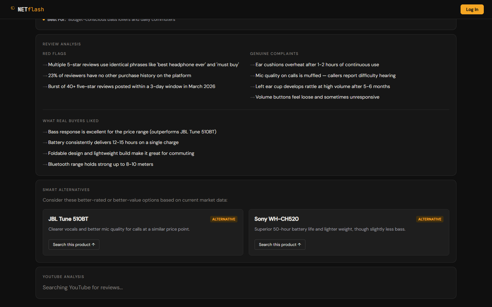

# NETflash — AI-Powered Product Intelligence Platform

<div align="center">



**Don't trust the reviews. Trust the data.**

*Fake review detection. Real price comparison. YouTube reviewer analysis. In seconds.*

[](https://nodejs.org/)
[](https://reactjs.org/)
[](https://www.mongodb.com/)
[](https://ai.google.dev/)

</div>

---

## What is NETflash?

NETflash is an advanced, AI-powered e-commerce analysis platform that protects buyers from fake reviews and overpriced products on Amazon, Flipkart, and Meesho.

Unlike basic review checkers, NETflash uses **Google's Gemini AI** to perform deep linguistic analysis on hundreds of reviews simultaneously — detecting suspicious patterns, evaluating seller reputation, and generating actionable buying intelligence.

---

## Features

### Review Radar & Fake Review Detection
Analyzes linguistic patterns across reviews to determine the percentage of genuine vs. suspicious vs. incentivized reviews. Detects burst posting patterns, generic language, and unverified reviewers.

### 30-Day Price Volatility Chart
A responsive area chart tracking the product's price fluctuations over 30 days, helping users identify whether the current price represents a genuine deal or an inflated "sale."

### Deep-Dive AI Intel
Generates structured breakdown of Build Quality, Value for Money, and Performance based purely on genuine user feedback. Identifies the ideal target audience for the product.

### Scam Seller Detection
Dedicated Trust Score evaluating the seller's return policies, shipping history, and known red flags. Risk levels: Safe / Caution / Avoid.

### Smart Alternatives Engine
Automatically suggests 2-3 better-rated or cheaper alternatives with specific reasons why they outperform the analyzed product.

### Watchlist & Price Tracking
Secure JWT-based authentication allows users to save products to a personalized dashboard and track price changes over time.

---

## Dashboard Preview

### AI Intelligence Dashboard

*Real-time Trust Score (6.8/10), Review Radar showing 28% suspicious reviews, AI Verdict recommending "BUY with caution", 30-day price chart, and Seller Reputation assessment for boAt Rockerz 450.*

### Deep-Dive Intel & Review Analysis

*Structured AI analysis: Build Quality (Average), Value for Money (Excellent), Performance metrics. Red flags detected including review burst patterns and unverified reviewers. Genuine complaints about ear cushion heating and mic quality.*

### Smart Alternatives & Review Breakdown

*AI-generated alternatives (JBL Tune 510BT for better vocals, Sony WH-CH520 for battery life). What real buyers liked: bass response, 12-15 hour battery, foldable design.*

---

## Tech Stack

| Layer | Technology |
|-------|-----------|
| **Frontend** | React 18, Vite, React Router DOM, Recharts |
| **Styling** | Vanilla CSS (Dark Mode, CSS Grid, Custom Design System) |
| **Backend** | Node.js, Express.js |
| **Database** | MongoDB Atlas, Mongoose ODM |
| **AI Engine** | Google Gemini AI (Generative AI SDK) |
| **Auth** | JWT, bcryptjs |
| **Data Sources** | RapidAPI (Amazon, Flipkart, Meesho scrapers) |
| **Screenshots** | Puppeteer (automated capture pipeline) |

---

## Architecture Highlights

- **Mock Fallback Engine:** If live e-commerce API scrapers fail (free-tier limits), the system silently generates realistic mock data. This ensures flawless demo presentations regardless of external API status.
- **DB-less Graceful Degradation:** If MongoDB is unreachable (IP restrictions), the backend bypasses caching and continues serving live AI analysis. The core product never crashes.
- **Structured AI Output:** Gemini responses are parsed as structured JSON with schema validation, enabling type-safe rendering of complex metrics across the frontend.

---

## Running Locally

### Prerequisites
- Node.js v18+
- MongoDB Atlas Account
- Google Gemini API Key
- RapidAPI Account (subscribe to Amazon, Flipkart, Meesho APIs — all free tier)

### Backend Setup
```bash
cd backend
npm install
```

Create `.env` in the `backend` directory:
```env
PORT=5000
MONGODB_URI=your_mongodb_connection_string
GEMINI_API_KEY=your_gemini_api_key
RAPIDAPI_KEY=your_rapidapi_key
YOUTUBE_API_KEY=your_youtube_api_key
```

```bash
node index.js
```

### Frontend Setup
```bash
cd frontend
npm install
npm run dev
```

Open `http://localhost:5173` in your browser.

---

## Project Structure
```
netflash/
├── backend/
│   ├── index.js              # Express server entry point
│   ├── routes/
│   │   ├── analyze.js        # Core AI analysis endpoint
│   │   ├── price.js          # Cross-platform price comparison
│   │   ├── auth.js           # User registration & login (JWT)
│   │   ├── watchlist.js      # Saved products CRUD
│   │   └── youtube.js        # YouTube review aggregation
│   ├── services/
│   │   ├── gemini.js         # Gemini AI integration
│   │   ├── amazon.js         # Amazon scraper + fallback
│   │   ├── flipkart.js       # Flipkart scraper + fallback
│   │   └── meesho.js         # Meesho scraper + fallback
│   ├── models/               # MongoDB schemas
│   ├── middleware/            # JWT auth middleware
│   └── utils/                # Logger, mock data engine
├── frontend/
│   ├── src/
│   │   ├── pages/
│   │   │   ├── Home.jsx      # Landing page
│   │   │   ├── Results.jsx   # Analysis dashboard
│   │   │   └── Dashboard.jsx # Watchlist page
│   │   ├── components/
│   │   │   ├── PriceHistoryChart.jsx
│   │   │   ├── SellerTrustCard.jsx
│   │   │   ├── AlternativesList.jsx
│   │   │   ├── ProductSummaryCard.jsx
│   │   │   ├── TrustScoreCard.jsx
│   │   │   ├── ReviewBreakdown.jsx
│   │   │   ├── AuthModal.jsx
│   │   │   └── ...
│   │   └── index.css         # Complete design system
│   └── package.json
├── screenshots/              # Auto-generated via Puppeteer
└── README.md
```

---

## License

MIT License — Free to use and modify.
